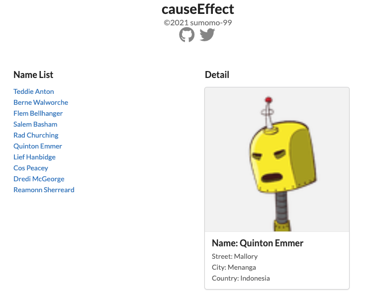

# Cause Effect App
リストをクリックすると詳細を表示するアプリケーションです。



## デモURL
[https://cause-effect-sumomo-99.vercel.app/](https://cause-effect-sumomo-99.vercel.app/)

## 開発サーバの起動
```bash
npm install
npm run dev
```
ブラウザで[http://localhost:3000](http://localhost:3000)にアクセスします。

## ビルド
```bash
npm run build
```

## テストデータ
テストデータの作成に、[Mockaroo](https://www.mockaroo.com/)を利用しました。